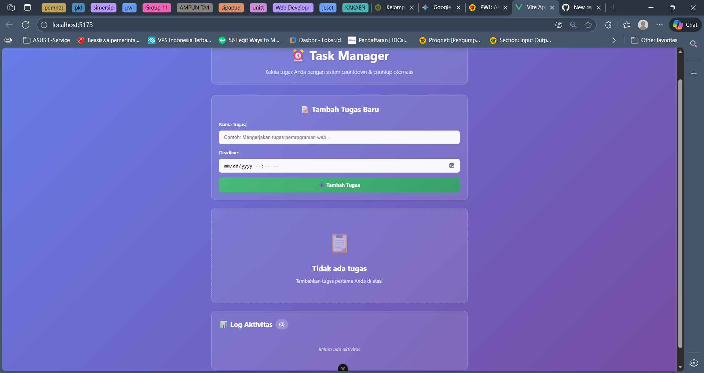
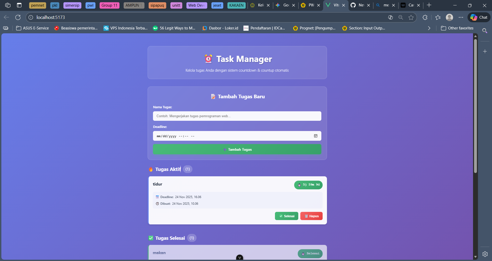
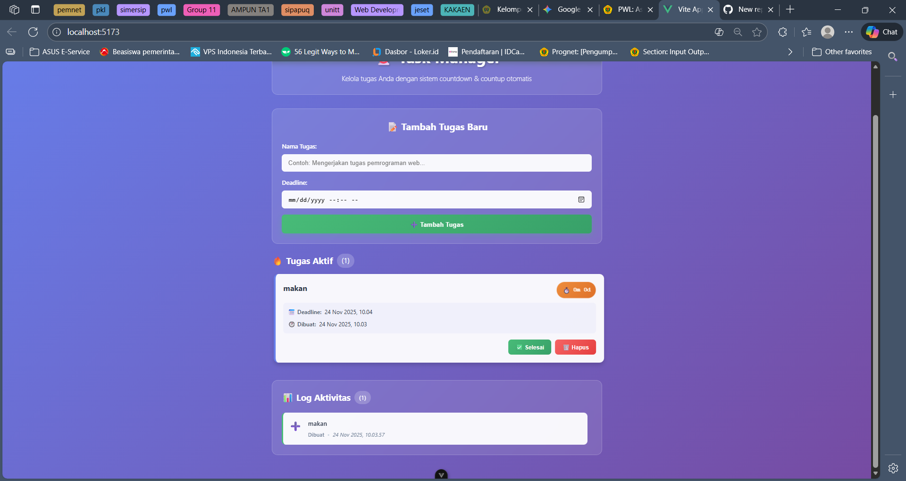
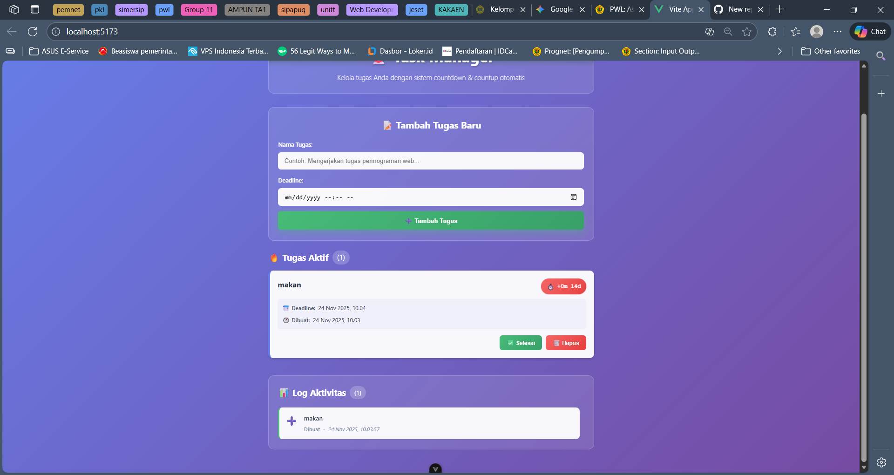
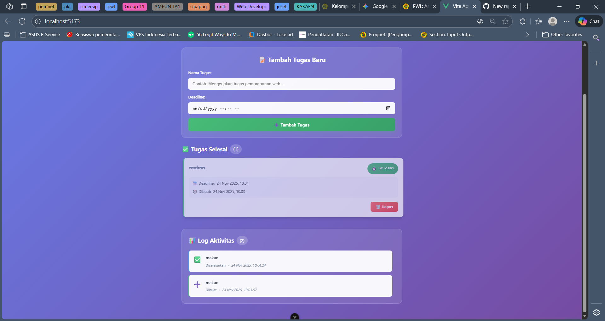

# Assignment: Vue.js – To-Do List with Deadline & Timer

## Identitas
- **Nama** : Muhammad Zidan Azzaki
- **NIM** : F1D022080

---

## Deskripsi Tugas
Pada tugas ini saya membuat aplikasi To-Do List **advanced** dengan sistem manajemen deadline menggunakan Vue.js 3 dan Composition API.

### 🎯 Fitur Utama:
- ✅ **Tambah Tugas** dengan nama dan deadline
- ⏰ **Countdown Timer** otomatis untuk setiap tugas
- 🔴 **Warning System**: Timer berubah merah jika sisa waktu < 1 jam
- ➕ **Countup Timer**: Menampilkan `+` dan merah jika sudah melewati deadline
- ✅ **Tandai Selesai** untuk menyelesaikan tugas
- 🗑️ **Hapus Tugas** dari daftar
- 📊 **Log Aktivitas** lengkap dengan timestamp
- 🎨 **UI Modern** dengan animasi dan gradient

### 🏗️ Arsitektur Modular:
- **Component-Based Architecture** - Pemisahan logika ke komponen terpisah
- **Composables** - Reusable logic untuk timer
- **Event-Driven** - Komunikasi antar komponen dengan emit
- **Reactive State** - Menggunakan Vue 3 Composition API

---

## Teknologi yang Digunakan
- **Vue.js 3** - Framework JavaScript progresif (Composition API)
- **Vite** - Build tool modern dan cepat
- **JavaScript ES6+** - Modern JavaScript syntax
- **CSS3** - Styling dengan animations dan gradients

---

## Struktur Proyek

```
src/
├── components/
│   ├── TaskForm.vue      # Form input tugas dengan deadline
│   ├── TaskList.vue      # Container untuk daftar tugas
│   ├── TaskItem.vue      # Item tugas individual dengan timer
│   └── TaskLog.vue       # Log aktivitas tugas
├── composables/
│   └── useTimer.js       # Logic countdown/countup timer
├── App.vue               # Main component
├── main.js               # Entry point
└── style.css             # Global styles
```

---

## Cara Menjalankan Aplikasi

### 1. Install Dependencies
```bash
npm install
```

### 2. Run Development Server
```bash
npm run dev
```

### 3. Buka Browser
Aplikasi akan berjalan di `http://localhost:5173`

### 4. Build untuk Production
```bash
npm run build
```

---

## 📚 Dokumentasi Komponen

### 1. **TaskForm.vue**
Komponen form untuk menambahkan tugas baru.

**Props**: Tidak ada

**Events**: 
- `add-task(newTask)` - Emit ketika tugas baru ditambahkan

**Fitur**:
- Input nama tugas (required)
- Input deadline dengan `datetime-local` (required)
- Validasi: deadline minimal waktu sekarang
- Auto-reset form setelah submit

**Struktur Data Task**:
```javascript
{
  id: Date.now(),           // Unique identifier
  name: "Nama tugas",       // String
  deadline: timestamp,       // Number (ms)
  createdAt: timestamp,      // Number (ms)
  completed: false           // Boolean
}
```

---

### 2. **TaskItem.vue**
Komponen untuk menampilkan satu item tugas dengan timer.

**Props**:
- `task` (Object, required) - Data tugas

**Events**:
- `delete-task(taskId)` - Emit untuk hapus tugas
- `complete-task(taskId)` - Emit untuk tandai selesai

**Fitur Timer**:
- **Normal** (hijau): Sisa waktu > 1 jam
- **Warning** (orange): Sisa waktu < 1 jam dengan animasi pulse
- **Expired** (merah): Sudah lewat deadline, tampilkan `+` dan countup
- **Completed** (hijau): Tugas sudah selesai

**Format Display**:
- Countdown: `1h 30m 45d` (hari, jam, menit, detik)
- Countup: `+0h 15m 30d` (dengan tanda plus)

---

### 3. **TaskList.vue**
Komponen container untuk mengelola dan menampilkan daftar tugas.

**Props**:
- `tasks` (Array, required) - Array of task objects

**Events**:
- `delete-task(taskId)` - Forward ke parent
- `complete-task(taskId)` - Forward ke parent

**Fitur**:
- Pemisahan otomatis: Tugas Aktif vs Tugas Selesai
- Counter jumlah tugas di setiap section
- Empty state ketika tidak ada tugas
- Responsive layout

---

### 4. **TaskLog.vue**
Komponen untuk menampilkan log aktivitas tugas.

**Props**:
- `logs` (Array, required) - Array of log objects

**Struktur Data Log**:
```javascript
{
  id: unique_id,
  type: 'created' | 'completed' | 'deleted',
  taskName: "Nama tugas",
  timestamp: timestamp
}
```

**Fitur**:
- Sort logs by timestamp (terbaru di atas)
- Icon dan warna berbeda per tipe log
- Scrollable list dengan custom scrollbar
- Animasi slide-in untuk log baru

---

### 5. **useTimer.js (Composable)**
Reusable composition function untuk logic timer.

**Parameter**:
- `deadline` (Number) - Timestamp deadline dalam ms

**Returns**:
```javascript
{
  timeDisplay,    // Computed: String format waktu
  timeStatus,     // Computed: 'normal' | 'warning' | 'expired'
  isExpired,      // Computed: Boolean
  remainingTime   // Computed: Number (ms)
}
```

**Logic**:
- Update setiap 1 detik menggunakan `setInterval`
- Auto cleanup dengan `onUnmounted`
- Format: hari, jam, menit, detik
- Deteksi warning jika < 1 jam (3600000 ms)
- Countup dengan prefix `+` jika sudah lewat deadline

---

## 🎨 Sistem Warna Timer

| Status | Kondisi | Warna | Animasi |
|--------|---------|-------|---------|
| **Normal** | Sisa > 1 jam | Hijau (#48bb78) | Tidak ada |
| **Warning** | Sisa < 1 jam | Orange (#ed8936) | Pulse |
| **Expired** | Sudah lewat | Merah (#f56565) | Pulse cepat |
| **Completed** | Selesai | Hijau (#48bb78) | Tidak ada |

---

## 📊 Flow Data

```
User Input (TaskForm)
    ↓
App.vue (State Management)
    ↓
TaskList → TaskItem (Display + Timer)
    ↓
User Action (Complete/Delete)
    ↓
Event Emit ke App.vue
    ↓
Update State + Add Log
    ↓
Re-render Components
```

---

## 🔑 Konsep Vue.js yang Digunakan

### 1. **Composition API**
```vue
<script setup>
import { ref, computed } from 'vue'

const tasks = ref([])
const addTask = (task) => {
  tasks.value.push(task)
}
</script>
```

### 2. **Component Communication**
```vue
<!-- Parent (App.vue) -->
<TaskForm @add-task="addTask" />

<!-- Child (TaskForm.vue) -->
const emit = defineEmits(['add-task'])
emit('add-task', newTask)
```

### 3. **Props & Events**
```vue
<!-- Parent -->
<TaskItem :task="task" @delete-task="handleDelete" />

<!-- Child -->
const props = defineProps({
  task: { type: Object, required: true }
})
```

### 4. **Composables (Reusable Logic)**
```javascript
// useTimer.js
export function useTimer(deadline) {
  const now = ref(Date.now())
  // ... logic
  return { timeDisplay, timeStatus }
}

// Dalam komponen
import { useTimer } from '@/composables/useTimer'
const { timeDisplay } = useTimer(props.task.deadline)
```

### 5. **Computed Properties**
```javascript
const activeTasks = computed(() => 
  props.tasks.filter(task => !task.completed)
)
```

### 6. **Lifecycle Hooks**
```javascript
onMounted(() => {
  intervalId = setInterval(updateTime, 1000)
})

onUnmounted(() => {
  clearInterval(intervalId)
})
```

### 7. **Conditional Rendering**
```vue
<div v-if="tasks.length === 0">Tidak ada tugas</div>
<div v-else>...</div>
```

### 8. **List Rendering**
```vue
<TaskItem 
  v-for="task in tasks" 
  :key="task.id"
  :task="task"
/>
```

### 9. **Event Handling**
```vue
<form @submit.prevent="handleSubmit">
<button @click="deleteTask(id)">
```

### 10. **Two-Way Binding**
```vue
<input v-model="taskName" />
```

---

## 🎯 Cara Kerja Fitur Utama

### Countdown Timer
1. Setiap TaskItem menerima `deadline` dari props
2. `useTimer` composable membuat reactive `now` yang update tiap detik
3. Hitung `remainingTime = deadline - now`
4. Format menjadi string readable (hari, jam, menit, detik)
5. Tentukan status berdasarkan remaining time
6. Return reactive values yang auto-update

### Countup Timer (Expired)
1. Ketika `remainingTime < 0`, timer masuk mode countup
2. Tambahkan prefix `+` pada display
3. Ubah warna menjadi merah
4. Animasi pulse untuk menarik perhatian

### Log Aktivitas
1. Setiap aksi (create/complete/delete) di App.vue
2. Push object log baru ke array `logs`
3. TaskLog menerima logs via props
4. Sort logs by timestamp (descending)
5. Display dengan icon dan warna sesuai tipe

---

## 📸 Hasil

### Tampilan Fitur:
1. **Form Input** - Input nama tugas dan pilih deadline


2. **Timer Normal** - Countdown hijau untuk tugas baru


3. **Timer Warning** - Orange dengan pulse jika < 1 jam


4. **Timer Expired** - Merah dengan `+` jika lewat deadline


5. **Task Completed dan Activity Log** - Tugas dan Riwayat yang sudah diselesaikan


---
